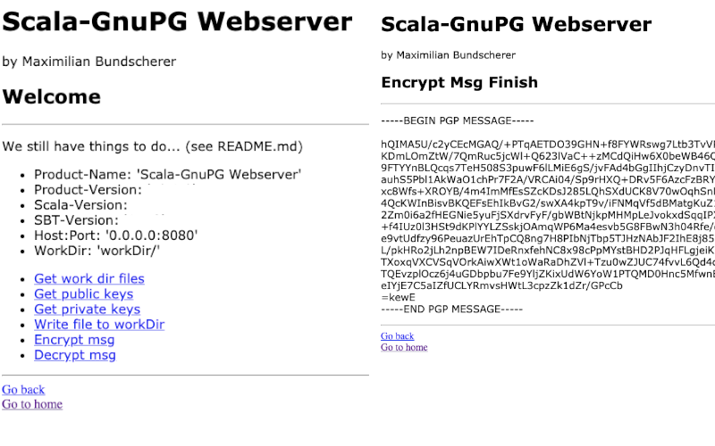

# GnuPG Webserver (Scala)

GnuPG Webserver written in Scala based on GnuPG-Shell.

``gnuPG - scala - akka http - shell``

Tested on macOS (with openJDK-11)

Author: [Maximilian Bundscherer](https://bundscherer-online.de)

## Features

- ✅ Simple html-engine with webServer ``http://localhost:8080/`` included
- ✅ Simple shell to html-engine included
- ✅ Continuous Integration (GitHub Actions) included (triggered auto by tag)
- ✅ Encrypt/Decrypt messages
- ✅ See your public gpg-keys
- ✅ See your private gpg-keys
- ...

## We still have things to do...

- ➡️ Encrypt/Decrypt files
- ➡️ Administrate public-keys
- ➡️ Administrate secret-keys
- ➡️ Generate keys
- ➡️ Awesome front-end
- ➡️ Don't use shell-gpg as dependency
- ➡️ Server/Client...
- ➡️ Improve Encrypt/Decrypt message...
- ...

## Let's get started

### Required

- ``gnupg`` (``brew install gnupg`` on macOS)
- ``java``
- ``sbt``

### Let's go

- See [config](./src/main/scala/de/maxbundscherer/gnupg/utils/Configuration.scala)
- Run with ``sbt run``
- Triggered Restart (recommend) ``sbt ~reStart``
- Assembly (jar) with ``sbt assembly``

## Continuous Integration

### Use release version from CI

- Download jar from [last build](actions/)
- Extract jar
- Create dir from [config](./src/main/scala/de/maxbundscherer/gnupg/utils/Configuration.scala)
- Run ``java -jar artifact.jar``

### Release own version

- Merge to ``main``-branch
- Set version in ``build.sbt`` e.g. ``v0.0.2``
- Release tag on gitHub e.g. ``v0.0.2``